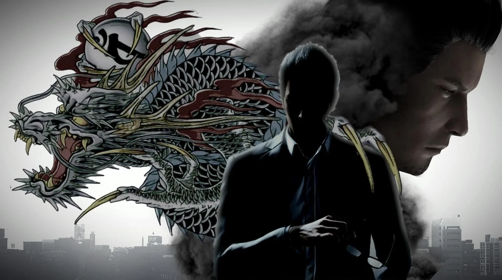

# The Dragon of Dojima

The guy from the hit game series: Yakuza/Like A Dragon.

Kazuma Kiryu (桐生 一馬, Kiryū Kazuma), also known as Joryu (浄龍, Jōryū), and Taichi Suzuki (鈴木 太一, Suzuki Taichi), is the former primary protagonist of the Like a Dragon (formerly Yakuza) series. He is currently an agent of the Daidoji Faction, the former fourth chairman of the Tojo Clan, the former manager of Morning Glory Orphanage, former taxi driver for Nagasu Taxi, former manager of Four Shine Sotenbori and a casual guest manager of Four Shine Tokyo.

Kiryu's legendary accomplishments and ascent through the ranks of the Tojo Clan's Dojima Family, as well as the dragon tattoo on his back, have earned him the nickname "The Dragon of Dojima" (堂島の龍, Dōjima no Ryū). 

## Discord Bot

This is a discord bot that is run through Rust's serenity framework with the poise's command library, to make slash commands and hardcoded prefix commands. It has a total of 15 commands. 12 are for fun, 3 for moderation. It has a huge meme library for the yakuza gamers. It is open sourced for any and all people of Discord to run. You can modify it for all you need:

